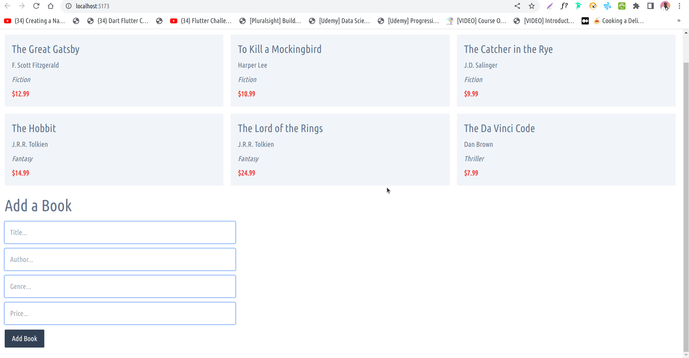

# Dexie-kit



> The tutorial provides step-by-step instructions on how to set up and configure a SvelteKit project and integrate Dexie.js to store and manage data in the browser.

## Creating a project

If you're seeing this, you've probably already done this step. Congrats!

```bash
# create a new project in the current directory
pnpm create svelte@latest

# create a new project in my-app
pnpm create svelte@latest my-app
```

## Developing

Once you've created a project and installed dependencies with `npm install` (or `pnpm install` or `yarn`), start a development server:

```bash
pnpm  dev

# or start the server and open the app in a new browser tab
npm run dev -- --open
```

## Building

To create a production version of your app:

```bash
pnpm run build
```

You can preview the production build with `npm run preview`.

> To deploy your app, you may need to install an [adapter](https://kit.svelte.dev/docs/adapters) for your target environment.
